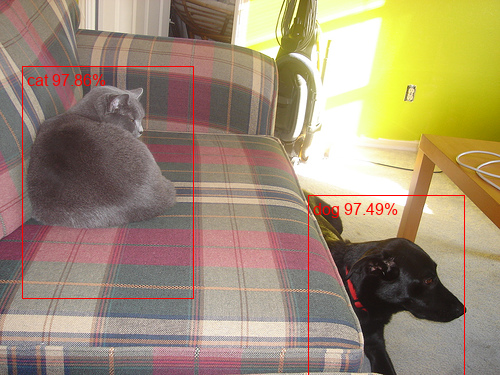

# Fast R-CNN pytorch
This is an implementation of Fast R-CNN using pytorch on the animal images of COCO dataset.    
Fast R-CNN uses ROIPooling to avoid repeated calculation in R-CNN and combines classification and location togerther using FC in neural networks.   
To prepare data, download and unzip in the COCO2017 folder.    
    
To install required packages, run
```
pip install -r requirements.txt
```

To create regions using selective search, run
```
python script/create_regions.py
```
This may take several hours to complete.    

Herein, vgg19_bn is used in Fast R-CNN to extract features.    
To train the model, run
```
python train.py --epochs num_epochs --cuda True/False
```
    
To test the model on specific images, run
```
python test.py --jpg_path jpg_path
```
test sample    
